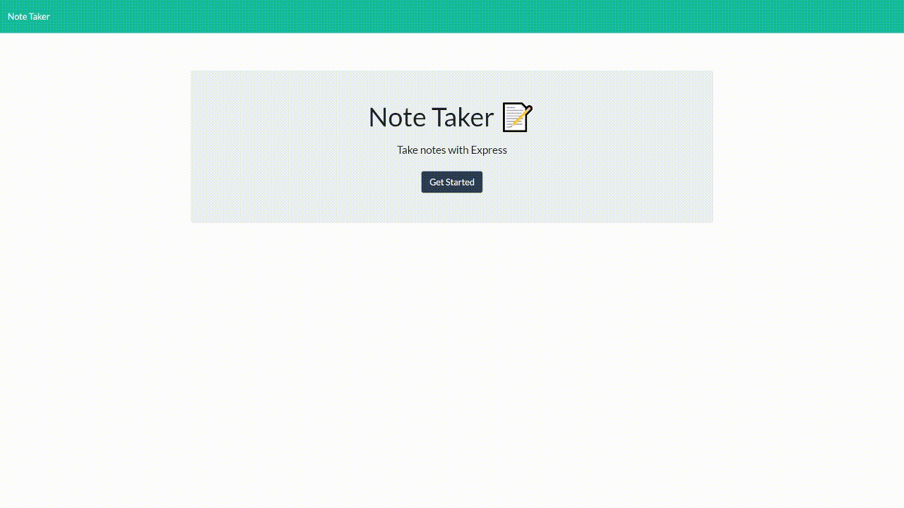

# Note Taker

## Table of Contents

- [Note Taker](#note-taker)
  - [Table of Contents](#table-of-contents)
  - [Description](#description)
  - [Installation](#installation)
  - [Usage](#usage)
  - [Built With](#built-with)
  - [Technologies Used](#technologies-used)
  - [Contributing](#contributing)
  - [License](#license)
  - [Questions](#questions)
  

## Description

A simple web application deployed on Heroku that can be used to write and save notes. This application will use an Express.js back end and will save and retrieve note data from a JSON file.

  

**See this unique experience in action!**

## Installation

1. [Install Node.js](https://nodejs.org/en/download/) 

2. Install required packages

        npm install

## Usage
[Deployed Link](https://note-taker-henrykam.herokuapp.com/)

To use on local host

        npm start

Note: this application will use PORT 3001

## Built With

* [HTML](https://developer.mozilla.org/en-US/docs/Web/HTML)
* [CSS](https://developer.mozilla.org/en-US/docs/Web/CSS)
* [JavaScript](https://developer.mozilla.org/en-US/docs/Web/JavaScript)
* [Node.js](https://nodejs.org/en/)
* [Express.js](https://expressjs.com/)
* [Uniqid](https://www.npmjs.com/package/uniqid)

## Technologies Used

* [Microsoft Visual Studio Code](https://code.visualstudio.com/)
* [Git Bash](https://git-scm.com/downloads)
* [GitHub](https://github.com/)
* [Insomnia](https://insomnia.rest/)
* [Heroku](https://www.heroku.com/)

## Contributing

**Henry Kam**

- [Github](https://github.com/gulpinhenry)
- [LinkedIn](https://www.linkedin.com/in/kamhenry/)

## License

This application is covered under the MIT license

## Questions

For any questions, please reach out by creating an issue.

